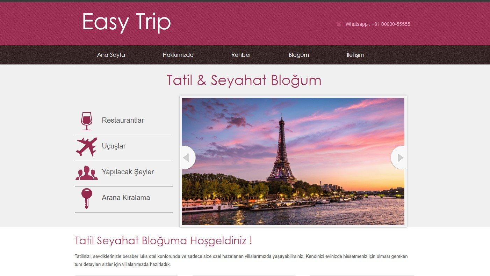
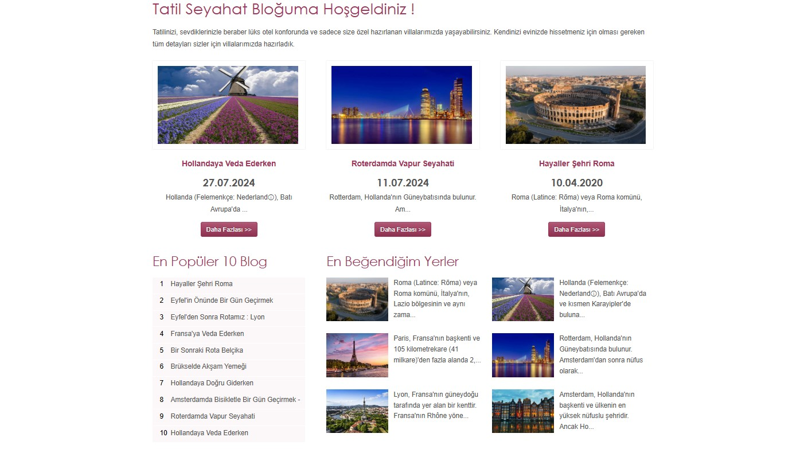
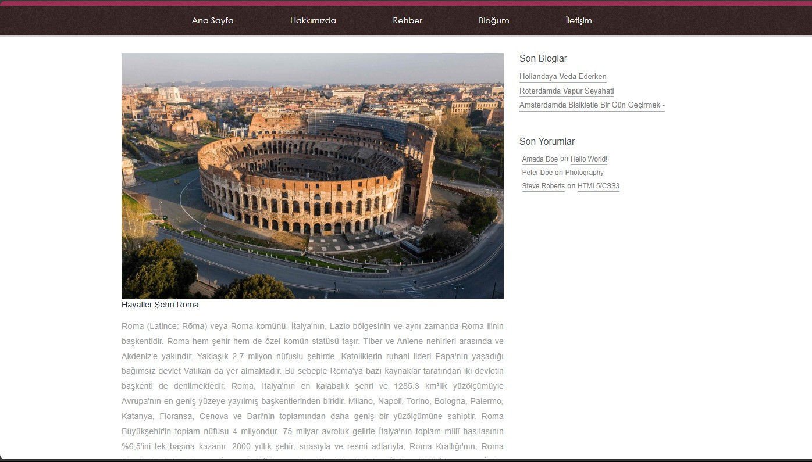
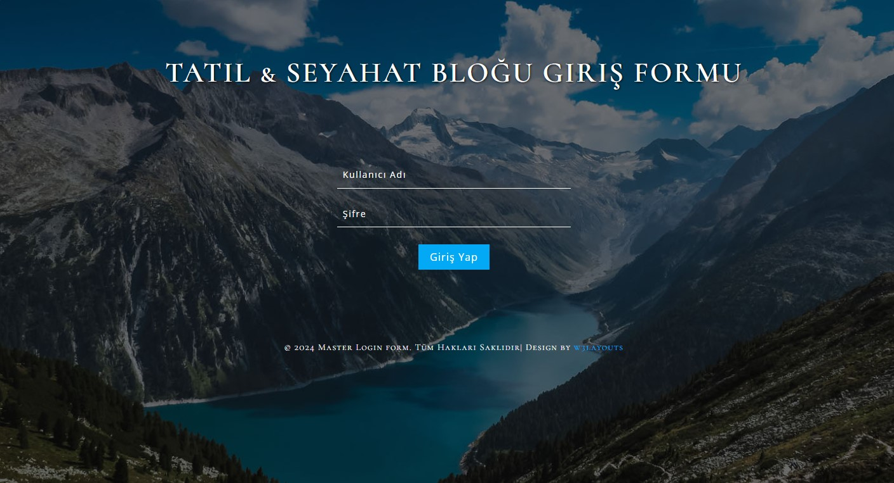
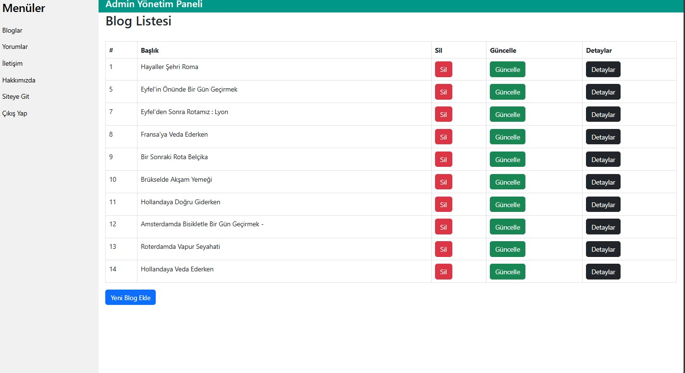
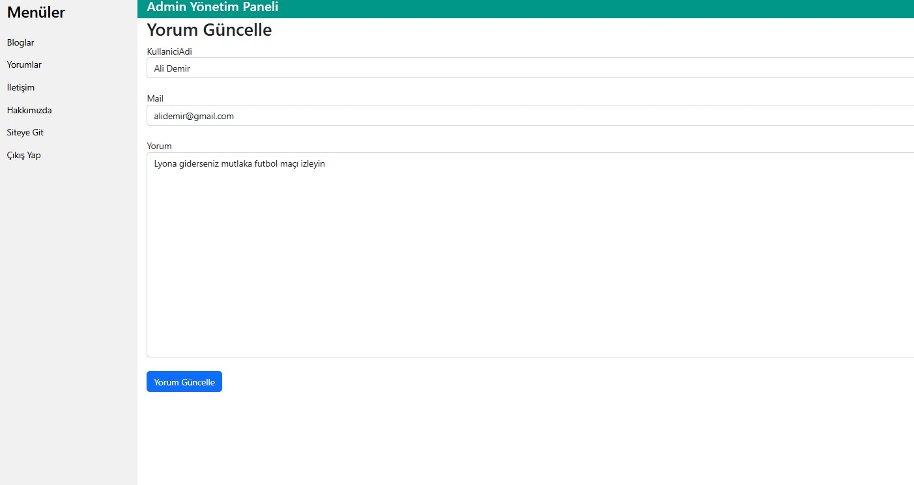

# Asp.Net Mvc5 ile Tatil Seyahat Sitesi 🌍

Bu proje, **ASP.NET MVC 5** kullanılarak geliştirilen bir tatil ve seyahat blog sitesi uygulamasıdır. Kullanıcılar, farklı blogları inceleyebilir ve detaylarını görüntüleyebilir. Ayrıca, yönetici paneli ile blogları ve yorumları kolayca yönetebilirler. ✍️

## Özellikler

- **ASP.NET MVC 5:** Projenin temel çatısı. 🏗️
- **Entity Framework:** Veritabanı işlemleri için kullanıldı. 💾
- **SQL Server:** Veritabanı yönetimi. 🗄️
- **Bootstrap:** Kullanıcı arayüzü için responsive tasarım. 📱
- **Authentication:** Kullanıcı girişi ve kaydı mevcut. 🔑
- **Admin Paneli:** Blogları ve Yorumları ekleme, silme, güncelleme ve listeleme işlemleri yapılabilir. 🛠️
- **Partial View Kullanımı:** Sayfa bölümlerinin tekrar kullanımını kolaylaştırmak için `Partial View` yapısı kullanılmıştır. 🔄
- **Gelişmiş Veri Yönetimi:** Yönetici arayüzü üzerinden içerik ve veri yönetimi sağlanır. 📊

## Kullanılan Teknolojiler

- **ASP.NET MVC 5** 🖥️
- **Entity Framework** 🔗
- **SQL Server** 🗃️
- **Bootstrap** 🎨
- **JavaScript, HTML, CSS** 🖋️

## Ekran Görüntüleri

### Veritabanı Yapısı


### Anasayfa



### Blog Görüntüleri


### Login Görüntüsü


### Admin Görüntüleri



## Kurulum

1. Bu projeyi yerel makinenize klonlayın:
   ```bash
   git clone https://github.com/DifferenTismail/Asp.Net-Mvc5-ile-Tatil-Seyahat-Sitesi.git
